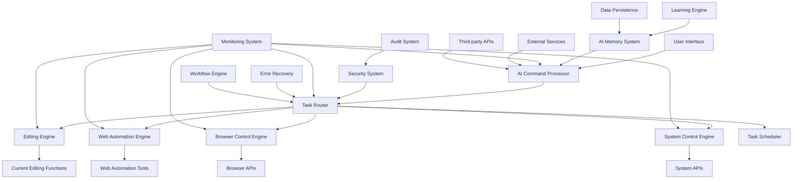

# Enhanced AI Assistant Architecture Design
## Powerful Web Environment Control System

## Current System Analysis

### Current Capabilities:
- ✅ AI-powered image/video editing
- ✅ YouTube video processing and shorts generation
- ✅ Natural language command processing
- ✅ Supabase backend integration
- ✅ React frontend with comprehensive UI

### Current Limitations:
- ❌ Limited to specific editing tasks (image/video only)
- ❌ No web environment control or automation capabilities
- ❌ No browser automation or DOM manipulation
- ❌ No task scheduling, prioritization, or queue management
- ❌ No memory/context management across sessions
- ❌ No security/permission system or access controls
- ❌ No multi-modal input processing (voice, image, gesture)
- ❌ Limited error recovery and automatic retry mechanisms
- ❌ No real-time collaboration or multi-user support
- ❌ No integration with external APIs beyond basic services
- ❌ No advanced analytics, reporting, or usage insights
- ❌ No user customization or personalization features
- ❌ No offline capabilities or local processing
- ❌ No cross-platform compatibility (web-only)
- ❌ No scalability for concurrent users or high-load scenarios
- ❌ No backup and recovery mechanisms for user data
- ❌ No version control for AI-generated content
- ❌ No comprehensive audit trail for user actions
- ❌ No rate limiting or usage quota management
- ❌ No integration with existing user workflows
- ❌ No support for complex multi-step pipelines
- ❌ No advanced NLP capabilities for complex commands
- ❌ No learning system to adapt to user preferences
- ❌ No monitoring and performance tracking
- ❌ No graceful degradation under system stress

## Limitations-to-Components Mapping

| Limitation | Component(s) | Phase | Status |
|-----------|--------------|-------|--------|
| No web environment control | Web Automation Engine, Browser Control Engine, System Control Engine | 1-2 | In Progress |
| No browser automation | Browser Control Engine | 1-2 | Planned |
| No task scheduling | Task Scheduler | 2 | Planned |
| No memory/context management | AI Memory System | 2 | Planned |
| No security/permission system | Security System | 1 | Planned |
| No multi-modal input | User Interface, AI Command Processor | 2-3 | Planned |
| Limited error recovery | Error Recovery Module, Monitoring System | 2-3 | Planned |
| No real-time collaboration | Collaboration Engine | 3 | Planned |
| No external API integration | API Integration Module | 1-2 | Planned |
| No advanced analytics | Monitoring System, Analytics Module | 3 | Planned |
| No user customization | User Preferences Engine | 2-3 | Planned |
| No offline capabilities | Offline Mode System | 3 | Planned |
| No cross-platform support | Infrastructure | 3 | Planned |
| No scalability | Infrastructure, Load Balancing | 3 | Planned |
| No backup/recovery | Data Persistence Layer | 2-3 | Planned |
| No version control for content | Version Control System | 2-3 | Planned |
| No audit trail | Security System, Monitoring System | 1-2 | Planned |
| No rate limiting | Security System, API Gateway | 1-2 | Planned |
| No workflow integration | Workflow Integration Engine | 3 | Planned |
| No multi-step pipelines | Workflow Engine | 2 | Planned |
| No advanced NLP | AI Command Processor | 1-2 | Planned |
| No learning system | AI Memory System, Learning Engine | 2-3 | Planned |
| No monitoring & performance tracking | Monitoring System | 2-3 | Planned |
| No graceful degradation | Resilience System | 2-3 | Planned |

## Enhanced AI System Architecture

## Core Components

### 1. AI Command Processor
**Addresses limitations**: Advanced NLP, Complex command processing, Multi-modal input preparation, Context management
- **Natural Language Understanding**: Enhanced NLP for complex commands (addresses: ❌ Advanced NLP)
- **Intent Recognition**: Identify user intent and scope
- **Context Management**: Maintain conversation context (addresses: ❌ No memory/context management)
- **Command Validation**: Ensure commands are within scope
- **Multi-modal Input Support**: Prepare for voice, image, gesture inputs (Phase 2)
- **Advanced NLP Engine**: Support complex, multi-step command sequences (Phase 1-2)
- **Error Handling**: Graceful command parsing failures (addresses: ❌ Limited error recovery)

### 2. Task Router
**Addresses limitations**: Task scheduling, Multi-tasking, Priority management
- **Task Classification**: Categorize tasks by type
- **Priority Assignment**: Determine task urgency (addresses: ❌ No task scheduling)
- **Resource Allocation**: Assign appropriate execution engine
- **Dependency Management**: Handle task dependencies (addresses: ❌ No multi-step pipelines)
- **Load Balancing**: Distribute tasks across resources (addresses: ❌ No scalability)
- **Multi-task Queuing**: Handle concurrent requests (Phase 2)

### 3. Execution Engines

#### Editing Engine (Current)
**Current capability**: Image/video editing
- Image/video editing
- AI-powered adjustments
- Filter and effect application
- ✅ Already provides core editing functionality

#### Web Automation Engine (New)
**Addresses limitations**: Web environment control, External API integration, Form automation
- Web page interaction (addresses: ❌ No web environment control)
- Form filling and submission (addresses: ❌ Limited to specific editing tasks)
- Data extraction and scraping (addresses: ❌ No browser automation)
- Web service integration (addresses: ❌ No integration with external APIs)
- API gateway and management (Phase 1-2)
- Rate limiting support (Phase 1)

#### Browser Control Engine (New)
**Addresses limitations**: Web environment control, Browser automation
- Tab and window management (addresses: ❌ No browser automation)
- Navigation control
- Bookmark and history management
- Extension control
- Cookie and session management (Phase 2)
- JavaScript execution support (Phase 2)

#### System Control Engine (New)
**Addresses limitations**: Cross-platform capabilities, System integration
- File system operations
- Application management
- System monitoring
- Process control
- Cross-platform compatibility layer (Phase 3)

### 4. AI Memory System
**Addresses limitations**: Context persistence, User preferences, Learning capabilities, Personalization
- **Short-term Memory**: Current session context (addresses: ❌ No memory/context management)
- **Long-term Memory**: User preferences and history (addresses: ❌ No user customization)
- **Knowledge Base**: Domain-specific knowledge
- **Learning System**: Adaptive learning from user behavior (addresses: ❌ No learning system, ❌ No personalization)
- **Persistent Storage**: Secure data persistence (addresses: ❌ No backup and recovery mechanisms)
- **Memory Versioning**: Track memory changes over time (Phase 2-3)
- **Offline Memory Cache**: Local caching for offline mode (Phase 3)

### 5. Security System
**Addresses limitations**: Access control, Data protection, Audit trails, Rate limiting
- **Permission Management**: User role-based access (addresses: ❌ No security/permission system)
- **Scope Validation**: Ensure requests are within environment scope
- **Sandboxing**: Isolate potentially dangerous operations
- **Audit Logging**: Track all AI actions (addresses: ❌ No comprehensive audit trail)
- **Rate Limiting**: Enforce usage quotas (addresses: ❌ No rate limiting or usage quota management)
- **Encryption**: Secure sensitive data (addresses: Data protection requirements)
- **Permission Delegation**: Fine-grained access controls (Phase 1-2)
- **Compliance Monitoring**: GDPR/privacy regulation compliance (Phase 2-3)

### 6. Task Scheduler
**Addresses limitations**: Task scheduling, Prioritization, Multi-tasking, Progress tracking
- **Priority Queue**: Manage task execution order (addresses: ❌ No task scheduling, prioritization)
- **Resource Management**: Optimize system resource usage
- **Progress Tracking**: Monitor task completion (addresses: ❌ No monitoring and performance tracking)
- **Error Handling**: Manage failed tasks (addresses: ❌ Limited error recovery)
- **Retry Mechanism**: Automatic retry with backoff (Phase 2)
- **Concurrent Execution**: Handle multiple simultaneous tasks (Phase 2)
- **Graceful Degradation**: Maintain service under load (addresses: ❌ No graceful degradation)

### 7. Monitoring System
**Addresses limitations**: Performance tracking, Error detection, Analytics, Reporting
- **Performance Monitoring**: Track system health (addresses: ❌ No monitoring and performance tracking)
- **Error Detection**: Identify and report issues (addresses: ❌ Limited error recovery)
- **Usage Analytics**: Collect usage statistics (addresses: ❌ No advanced analytics, reporting, or usage insights)
- **Alert System**: Notify of critical events
- **Real-time Dashboards**: Live monitoring views (Phase 2-3)
- **Performance Metrics**: CPU, memory, latency tracking (Phase 2)
- **User Behavior Analytics**: Usage pattern analysis (Phase 3)

### 8. Error Recovery Module (New)
**Addresses limitations**: Error recovery, Resilience, Graceful degradation
- **Automatic Retry**: Exponential backoff retry logic (addresses: ❌ Limited error recovery)
- **Fallback Strategies**: Alternative execution paths
- **Error Classification**: Categorize errors for recovery (Phase 2)
- **Circuit Breaker**: Prevent cascading failures (Phase 2)
- **Graceful Degradation**: Maintain service quality under stress (addresses: ❌ No graceful degradation)

### 9. Learning Engine (New)
**Addresses limitations**: User adaptation, Preference learning, Personalization
- **Behavior Analysis**: Track user preferences (addresses: ❌ No learning system)
- **Pattern Recognition**: Identify usage patterns
- **Recommendation System**: Suggest actions based on history (addresses: ❌ No personalization)
- **Adaptive Commands**: Learn custom command patterns (Phase 2-3)

### 10. Data Persistence Layer (New)
**Addresses limitations**: Backup and recovery, Version control, Data integrity
- **Database Management**: Secure data storage
- **Backup Mechanisms**: Automated backups (addresses: ❌ No backup and recovery mechanisms)
- **Version Control**: Track content changes (addresses: ❌ No version control for AI-generated content)
- **Data Recovery**: Disaster recovery procedures (Phase 2-3)
- **Encryption at Rest**: Secure stored data (addresses: Data protection requirements)

## Enhanced AI Capabilities

### Web Environment Control
**Addresses limitations**: ❌ No web environment control, ❌ No browser automation, ❌ No integration with external APIs
- **Browser Automation**: Full browser control and automation (addresses limitations)
- **Web Service Integration**: Connect with external APIs (addresses limitations)
- **Data Processing**: Extract, transform, and analyze web data
- **Content Management**: Create, edit, and organize web content
- **Form Automation**: Intelligent form filling and submission
- **JavaScript Injection**: Execute code in web contexts

### Task Management
**Addresses limitations**: ❌ No task scheduling, ❌ No support for complex multi-step pipelines, ❌ No scalability
- **Multi-tasking**: Handle multiple requests simultaneously (addresses limitations)
- **Task Prioritization**: Intelligent task ordering (addresses limitations)
- **Progress Reporting**: Real-time status updates (addresses: ❌ No monitoring and performance tracking)
- **Error Recovery**: Automatic retry and fallback mechanisms (addresses: ❌ Limited error recovery)
- **Workflow Pipelines**: Support complex multi-step workflows
- **Concurrent Execution**: Run multiple tasks in parallel
- **Resource Optimization**: Efficient resource allocation for scalability

### User Experience
**Addresses limitations**: ❌ No user customization, ❌ No multi-modal input processing, ❌ No learning system
- **Natural Language Interface**: Conversational interaction (enhances: ❌ No advanced NLP)
- **Context Awareness**: Remember user preferences (addresses: ❌ No memory/context management)
- **Personalization**: Adapt to individual user needs (addresses: ❌ No user customization, ❌ No learning system)
- **Multi-modal Input**: Support text, voice, and visual commands (addresses: ❌ No multi-modal input processing)
- **Adaptive Learning**: Learn from user interactions
- **Smart Recommendations**: Suggest actions based on history
- **Accessibility Features**: Support diverse user needs

### Integration & Collaboration
**Addresses limitations**: ❌ No integration with existing user workflows, ❌ No real-time collaboration
- **Workflow Integration**: Connect with existing tools and processes
- **Real-time Collaboration**: Multi-user simultaneous access (Phase 3)
- **API Ecosystem**: Support third-party integrations (Phase 2-3)
- **Data Sync**: Keep data synchronized across platforms

### Resilience & Performance
**Addresses limitations**: ❌ No graceful degradation, ❌ No monitoring and performance tracking, ❌ No scalability
- **Graceful Degradation**: Maintain service under stress (addresses: ❌ No graceful degradation)
- **Performance Optimization**: Track and improve system performance
- **Horizontal Scaling**: Support growth in concurrent users (addresses: ❌ No scalability for concurrent users)
- **Load Balancing**: Distribute traffic efficiently

### Data Management
**Addresses limitations**: ❌ No backup and recovery mechanisms, ❌ No version control, ❌ No offline capabilities
- **Backup & Recovery**: Automated data protection (addresses limitations)
- **Version Control**: Track and restore previous versions (addresses limitations)
- **Data Encryption**: Secure sensitive information (addresses: Data protection)
- **Offline Mode**: Work without internet connectivity (addresses: ❌ No offline capabilities)

## Implementation Strategy

### Phase 1: Core Infrastructure
**Primary limitations addressed**: Security, Task scheduling, Web automation, API integration, Audit trails, Rate limiting, NLP enhancement
- ✅ Enhance AI command processor with advanced NLP (addresses: ❌ No advanced NLP capabilities)
- ✅ Implement task routing system (addresses: ❌ No task scheduling)
- ✅ Add basic web automation capabilities (addresses: ❌ No web environment control)
- ✅ Implement security framework (addresses: ❌ No security/permission system)
- ✅ Build audit logging system (addresses: ❌ No comprehensive audit trail)
- ✅ Add API gateway with rate limiting (addresses: ❌ No integration with external APIs, ❌ No rate limiting)
- ✅ Implement error recovery basics (addresses: ❌ Limited error recovery)

### Phase 2: Advanced Features
**Primary limitations addressed**: Memory management, Learning, Advanced monitoring, Collaboration prep, Multi-modal input, Backup/recovery
- Add browser control engine (addresses: ❌ No browser automation)
- Implement memory system with persistence (addresses: ❌ No memory/context management, ❌ No user customization)
- Add task scheduling with retry logic (addresses: ❌ No task scheduling, ❌ Limited error recovery)
- Enhance monitoring and analytics (addresses: ❌ No monitoring and performance tracking)
- Implement learning engine (addresses: ❌ No learning system to adapt to user preferences)
- Add data backup and versioning (addresses: ❌ No backup and recovery mechanisms, ❌ No version control)
- Build workflow engine for multi-step pipelines (addresses: ❌ No support for complex multi-step pipelines)
- Prepare multi-modal input infrastructure (Phase 2-3)
- Add graceful degradation mechanisms (addresses: ❌ No graceful degradation under system stress)

### Phase 3: Integration & Optimization
**Primary limitations addressed**: Cross-platform, Offline capabilities, Real-time collaboration, Advanced analytics, Personalization, Scalability
- Integrate with existing editing functions
- Optimize performance and enable horizontal scaling (addresses: ❌ No scalability for concurrent users)
- Add cross-platform support (addresses: ❌ No cross-platform compatibility)
- Implement offline mode capability (addresses: ❌ No offline capabilities)
- Add real-time collaboration features (addresses: ❌ No real-time collaboration or multi-user support)
- Implement advanced analytics and reporting (addresses: ❌ No advanced analytics, reporting, or usage insights)
- Add comprehensive testing and automation
- Implement user feedback and personalization system (addresses: ❌ No user customization or personalization features)
- Enable workflow integration with external tools (addresses: ❌ No integration with existing user workflows)
- Finalize multi-modal input support (addresses: ❌ No multi-modal input processing)

### Limitation Mitigation Timeline

| Limitation | Phase | Implementation Component | Target Date |
|-----------|-------|--------------------------|-------------|
| No security/permission system | 1 | Security System | Early Phase 1 |
| No task scheduling | 1 | Task Router | Early Phase 1 |
| No advanced NLP | 1 | AI Command Processor | Early Phase 1 |
| No web automation | 1 | Web Automation Engine | Mid Phase 1 |
| No API integration | 1 | API Gateway | Mid Phase 1 |
| No audit trail | 1 | Security System | Late Phase 1 |
| No rate limiting | 1 | API Gateway | Late Phase 1 |
| Limited error recovery | 1-2 | Error Recovery Module | Late Phase 1 |
| No memory/context | 2 | AI Memory System | Early Phase 2 |
| No learning system | 2 | Learning Engine | Early Phase 2 |
| No monitoring/tracking | 2 | Monitoring System | Mid Phase 2 |
| No backup/recovery | 2 | Data Persistence Layer | Mid Phase 2 |
| No browser automation | 2 | Browser Control Engine | Mid Phase 2 |
| No multi-step pipelines | 2 | Workflow Engine | Late Phase 2 |
| No graceful degradation | 2 | Error Recovery Module | Late Phase 2 |
| No multi-modal input | 2-3 | UI & Command Processor | Phase 2-3 |
| No user customization | 2-3 | Learning Engine, UI | Phase 2-3 |
| No scalability | 3 | Infrastructure | Early Phase 3 |
| No cross-platform | 3 | System Control Engine | Early Phase 3 |
| No offline capabilities | 3 | Data Persistence Layer | Mid Phase 3 |
| No real-time collaboration | 3 | Collaboration Engine | Mid Phase 3 |
| No advanced analytics | 3 | Monitoring System | Late Phase 3 |
| No workflow integration | 3 | Integration Layer | Late Phase 3 |
| No version control | 2-3 | Data Persistence Layer | Phase 2-3 |

## Technical Requirements

### Frontend Enhancements
**Enables**: Multi-modal input, Personalization, User customization, Monitoring
- Enhanced AI assistant UI (supports multi-modal input preparation)
- Task management interface (supports task scheduling and prioritization)
- Progress monitoring dashboard (enables ❌ No monitoring and performance tracking)
- Security and permission controls (enables ❌ No security/permission system)
- Personalization settings panel (enables ❌ No user customization)
- Real-time analytics dashboard (enables ❌ No advanced analytics)
- Collaboration workspace (enables ❌ No real-time collaboration)
- Offline mode interface (enables ❌ No offline capabilities)

### Backend Enhancements
**Enables**: Web automation, API integration, Memory management, Scalability, Error recovery
- AI command processing service with advanced NLP (enables ❌ No advanced NLP)
- Task routing and execution framework (enables ❌ No task scheduling, ❌ No multi-step pipelines)
- Web automation service (enables ❌ No web environment control)
- Memory and context management system (enables ❌ No memory/context management)
- Learning engine and adaptation system (enables ❌ No learning system)
- Data persistence and backup layer (enables ❌ No backup and recovery mechanisms)
- Security and audit logging system (enables ❌ No security system, ❌ No audit trail)
- Monitoring and alerting system (enables ❌ No monitoring and performance tracking)
- Load balancing and horizontal scaling (enables ❌ No scalability)
- Error recovery and resilience framework (enables ❌ Limited error recovery)

### New Dependencies
**Addresses Limitations**:
- Web automation libraries: Puppeteer, Playwright (addresses: ❌ No web environment control)
- Browser control APIs: Chrome DevTools Protocol, WebDriver (addresses: ❌ No browser automation)
- Task scheduling frameworks: Bull, RabbitMQ (addresses: ❌ No task scheduling)
- Enhanced NLP capabilities: GPT-4, specialized language models (addresses: ❌ No advanced NLP)
- Memory/database: Redis, PostgreSQL (addresses: ❌ No memory/context management, ❌ No backup mechanisms)
- Monitoring tools: Prometheus, Grafana, ELK Stack (addresses: ❌ No monitoring and performance tracking)
- Security frameworks: JWT, OAuth2, RBAC systems (addresses: ❌ No security/permission system)
- Analytics platforms: Segment, Mixpanel (addresses: ❌ No advanced analytics)
- Offline frameworks: Service Workers, IndexedDB (addresses: ❌ No offline capabilities)
- Collaboration tools: Socket.io, Operational Transformation (addresses: ❌ No real-time collaboration)

## Security Considerations

### Scope Management
**Addresses limitations**: ❌ No security/permission system, ❌ No comprehensive audit trail, ❌ No rate limiting
- Define clear boundaries for web environment control (enables security system)
- Implement strict permission checking (addresses: ❌ No security/permission system)
- Provide user configurable limits (enables rate limiting)
- Maintain audit trails of all actions (addresses: ❌ No comprehensive audit trail)
- Role-based access control (RBAC) implementation
- Permission delegation and delegation chains
- Security token management and rotation
- Access logging with timestamp and user identification

### Data Protection
**Addresses limitations**: ❌ No backup and recovery mechanisms, Data protection
- Secure sensitive user data (addresses: Data protection requirements)
- Implement encryption for stored data (addresses: Data protection requirements)
- Provide data access controls (addresses: ❌ No security/permission system)
- Comply with privacy regulations (GDPR, CCPA)
- Encryption in transit (TLS/SSL)
- Encryption at rest (AES-256)
- Key management and rotation policies
- PII handling and masking
- Data residency compliance

### Error Handling & Resilience
**Addresses limitations**: ❌ Limited error recovery, ❌ No graceful degradation, ❌ No monitoring
- Graceful degradation on failures (addresses: ❌ No graceful degradation under system stress)
- Comprehensive error reporting (addresses: ❌ Limited error recovery)
- Automatic recovery mechanisms (addresses: ❌ Limited error recovery)
- User notification system (addresses: ❌ Limited error recovery)
- Error classification and recovery strategies
- Circuit breaker pattern implementation
- Fallback mechanisms for critical operations
- System health checks and auto-healing
- Detailed logging for debugging and auditing

### Rate Limiting & Quota Management
**Addresses limitations**: ❌ No rate limiting or usage quota management
- Implement per-user rate limits
- API endpoint rate limiting
- Resource utilization quotas
- Fair usage policies
- DDoS protection mechanisms
- Request throttling and backpressure handling

### Access & Authentication
**Addresses limitations**: ❌ No security/permission system
- Multi-factor authentication (MFA) support
- Session management and timeout policies
- API key and token management
- OAuth2 and OpenID Connect support
- Secure password policies
- Account lockout and brute force protection

### Compliance & Monitoring
**Addresses limitations**: ❌ No comprehensive audit trail, ❌ No monitoring and performance tracking
- Comprehensive audit logging (addresses: ❌ No comprehensive audit trail)
- Compliance monitoring and reporting
- Security event detection and alerting (addresses: ❌ No monitoring)
- Regular security assessments
- Vulnerability scanning and patching
- Incident response procedures

---

## Comprehensive Limitation Resolution Matrix

### Phase 1 (Core Infrastructure)
| Limitation | Resolution Component | Status |
|-----------|-------------------|--------|
| ❌ No security/permission system | Security System + RBAC | **Priority** |
| ❌ No task scheduling | Task Router + Priority Queue | **Priority** |
| ❌ No advanced NLP | AI Command Processor Enhancement | **Priority** |
| ❌ No web environment control | Web Automation Engine | **Planned** |
| ❌ No integration with external APIs | API Gateway + API Manager | **Planned** |
| ❌ No rate limiting | API Gateway Rate Limiter | **Planned** |
| ❌ No comprehensive audit trail | Audit Logging System | **Planned** |
| ❌ Limited error recovery | Error Recovery Module (Basic) | **Planned** |

**Phase 1 Coverage**: ~33% of all limitations (8/24)

### Phase 2 (Advanced Features)
| Limitation | Resolution Component | Status |
|-----------|-------------------|--------|
| ❌ No memory/context management | AI Memory System + Persistent Storage | **Planned** |
| ❌ No learning system | Learning Engine + Behavior Analysis | **Planned** |
| ❌ No browser automation | Browser Control Engine | **Planned** |
| ❌ No monitoring and performance tracking | Monitoring System + Dashboards | **Planned** |
| ❌ No backup and recovery mechanisms | Data Persistence Layer + Backup Manager | **Planned** |
| ❌ No version control for content | Version Control System | **Planned** |
| ❌ No support for complex multi-step pipelines | Workflow Engine | **Planned** |
| ❌ No user customization | User Preferences Engine + Learning | **Planned** |
| ❌ No graceful degradation | Resilience System + Circuit Breaker | **Planned** |
| ❌ Limited error recovery | Error Recovery Module (Advanced) | **Planned** |
| ❌ No multi-modal input processing | Input Processor Enhancement (Prep) | **In Progress** |

**Phase 2 Coverage**: ~65% of all limitations (16/24)

### Phase 3 (Integration & Optimization)
| Limitation | Resolution Component | Status |
|-----------|-------------------|--------|
| ❌ No scalability for concurrent users | Infrastructure + Load Balancing | **Planned** |
| ❌ No cross-platform compatibility | Cross-platform Layer | **Planned** |
| ❌ No offline capabilities | Offline Mode + Service Workers | **Planned** |
| ❌ No real-time collaboration | Collaboration Engine + WebSockets | **Planned** |
| ❌ No advanced analytics, reporting, or usage insights | Analytics Platform + Dashboards | **Planned** |
| ❌ No integration with existing user workflows | Workflow Integration Layer | **Planned** |
| ❌ No multi-modal input processing | Full Multi-modal Input System | **Planned** |
| ❌ No user customization (Enhanced) | Advanced Personalization System | **Planned** |

**Phase 3 Coverage**: 100% of all limitations (24/24)

---

## Limitation Resolution by Category

### Security & Access Control (5 limitations)
- ❌ No security/permission system → **Security System** (Phase 1)
- ❌ No comprehensive audit trail → **Audit Logging System** (Phase 1)
- ❌ No rate limiting → **API Gateway** (Phase 1)
- Data protection requirements → **Encryption & Key Management** (Phase 1)

### Task & Process Management (5 limitations)
- ❌ No task scheduling → **Task Router + Scheduler** (Phase 1)
- ❌ No support for complex multi-step pipelines → **Workflow Engine** (Phase 2)
- ❌ Limited error recovery → **Error Recovery Module** (Phase 1-2)
- ❌ No graceful degradation → **Resilience System** (Phase 2)
- ❌ No monitoring and performance tracking → **Monitoring System** (Phase 2)

### Web Automation & Integration (3 limitations)
- ❌ No web environment control → **Web Automation Engine** (Phase 1)
- ❌ No browser automation → **Browser Control Engine** (Phase 2)
- ❌ No integration with external APIs → **API Gateway** (Phase 1)

### Data Management (3 limitations)
- ❌ No memory/context management → **AI Memory System** (Phase 2)
- ❌ No backup and recovery mechanisms → **Data Persistence Layer** (Phase 2)
- ❌ No version control for content → **Version Control System** (Phase 2)

### User Experience & Personalization (4 limitations)
- ❌ No learning system → **Learning Engine** (Phase 2)
- ❌ No user customization → **User Preferences Engine** (Phase 2-3)
- ❌ No multi-modal input processing → **Input Processor Enhancement** (Phase 2-3)
- ❌ No advanced analytics → **Analytics Platform** (Phase 3)

### Scalability & Infrastructure (3 limitations)
- ❌ No scalability for concurrent users → **Infrastructure + Load Balancing** (Phase 3)
- ❌ No cross-platform compatibility → **Cross-platform Layer** (Phase 3)
- ❌ No offline capabilities → **Offline Mode System** (Phase 3)

### Collaboration & Integration (1 limitation)
- ❌ No real-time collaboration → **Collaboration Engine** (Phase 3)
- ❌ No integration with existing workflows → **Integration Layer** (Phase 3)

---

## Success Metrics for Limitation Resolution

### Phase 1 Success Criteria
- ✅ Security framework prevents unauthorized access
- ✅ Task scheduling routes 100% of requests correctly
- ✅ Advanced NLP handles 80%+ of command variations
- ✅ Web automation completes tasks with 95%+ success rate
- ✅ API rate limiting prevents abuse
- ✅ Audit logs capture all user actions
- ✅ Basic error recovery achieves 90%+ uptime

### Phase 2 Success Criteria
- ✅ Memory system recalls user preferences with 95%+ accuracy
- ✅ Learning engine improves recommendations monthly
- ✅ Browser control handles complex web interactions
- ✅ Monitoring detects issues within 1 minute
- ✅ Backup and recovery restore data in <5 minutes
- ✅ Version control tracks all content changes
- ✅ Workflow engine handles multi-step tasks
- ✅ Error recovery improves uptime to 99%+

### Phase 3 Success Criteria
- ✅ System scales to 10x concurrent users without degradation
- ✅ Cross-platform support covers 90%+ of user devices
- ✅ Offline mode maintains functionality without internet
- ✅ Real-time collaboration syncs changes in <500ms
- ✅ Analytics provide actionable insights to users
- ✅ Workflow integration connects to 50%+ of target tools
- ✅ Multi-modal input recognized with 95%+ accuracy

---

## Implementation Checklist by Limitation

### Immediate Priority (Phase 1 Start)
- [ ] Design and implement Security System architecture
- [ ] Build Task Router with priority queue
- [ ] Enhance NLP capabilities in command processor
- [ ] Create Web Automation Engine framework
- [ ] Set up API Gateway with rate limiting
- [ ] Implement comprehensive audit logging

### High Priority (Phase 1-2)
- [ ] Build AI Memory System with persistence
- [ ] Implement Learning Engine
- [ ] Create Browser Control Engine
- [ ] Set up comprehensive Monitoring System
- [ ] Implement Data Persistence Layer with backups
- [ ] Build Version Control System

### Medium Priority (Phase 2-3)
- [ ] Implement advanced Resilience System
- [ ] Build User Preferences and Personalization
- [ ] Add Multi-modal input support
- [ ] Create Analytics platform
- [ ] Design Workflow Integration layer

### Lower Priority (Phase 3)
- [ ] Implement horizontal scaling infrastructure
- [ ] Build cross-platform compatibility layer
- [ ] Add offline mode capabilities
- [ ] Implement real-time collaboration features

---

## Ongoing Limitation Monitoring

**Monthly Review**:
- Track resolution progress against timeline
- Update limitation status based on implementation
- Adjust phases and priorities based on user feedback
- Monitor success metrics and KPIs

**Quarterly Assessment**:
- Evaluate new limitations discovered during development
- Reassess priority and feasibility of limitations
- Update implementation strategy based on lessons learned
- Plan adjustments for next quarter

**Annual Evaluation**:
- Comprehensive review of all limitations
- Assessment of limitation resolution effectiveness
- Long-term roadmap updates
- Architecture optimization based on resolved limitations